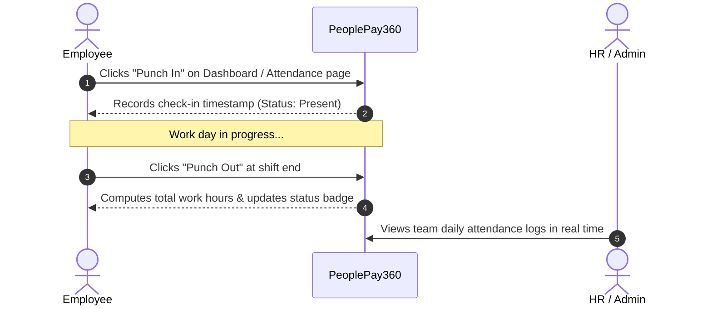
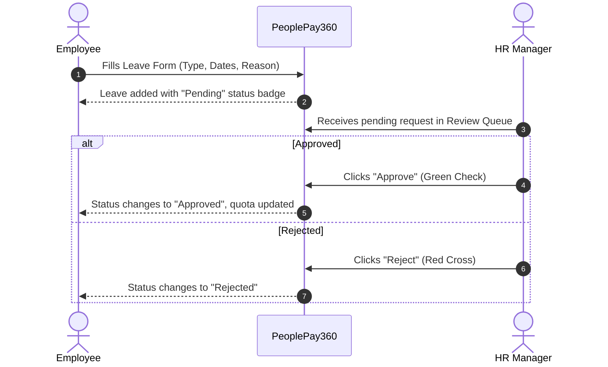
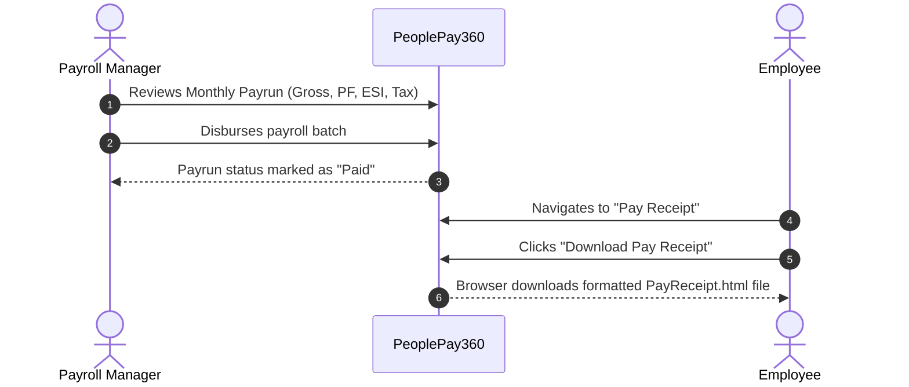

# 💼 PeoplePay360 — HR & Payroll Operations Platform

A modern, full-stack HR Operations and Automated Payroll platform built with **React**, **TypeScript**, **Node.js**, **Express**, **Prisma ORM**, and **PostgreSQL**. 

Designed with clean typography, dynamic micro-animations, and **strict role-based data isolation** — ensuring every team member sees only the data relevant to their role.

---

## ✨ Key Highlights

- 🛡️ **Role-Based Access Control (RBAC)**: Complete isolation between Admin, HR, Payroll, and Employee views. Unauthorized routes redirect cleanly without intrusive error screens.
- ⏱️ **Live Attendance & Punch Clock**: Real-time clock-in / clock-out logging with live session duration calculations.
- 🌴 **Leave Application & Review**: Self-service leave requests for employees with instant 1-click approval/rejection queues for HR managers.
- 💸 **Payroll Runs & Digital Pay Receipts**: Automated salary calculations, deductions breakdown, and instant downloadable pay receipts for employees.
- 🏢 **Department & Staff Directory**: Manage organization hierarchy, employee records, designations, and bank details.
- 🎨 **Modern Visual Aesthetics**: Glassmorphic backdrops, ambient dark gradients on authentication, responsive topbar navigation, and animated toast feedback.

---

## 🎭 Roles & Access Matrix

| Feature / Module | 👑 Super Admin | 👔 HR Manager | 📋 HR Executive | 💰 Payroll Manager | 👤 Employee |
| :--- | :---: | :---: | :---: | :---: | :---: |
| **Dashboard** | Full Company Stats | HR Overview | HR Overview | Payroll Overview | Personal Overview |
| **Attendance Punch** | ✅ | ✅ | ✅ | ✅ | ✅ (Personal) |
| **Staff Directory** | Full (with Salary & Add Staff) | View Directory (No Salary / No Add) | View Directory (No Salary / No Add) | View Directory (with Salary) | 🔒 Personal Profile Only |
| **Add Employee** | ✅ Admin Only | ❌ Hidden | ❌ Hidden | ❌ Hidden | ❌ Hidden |
| **Leave Approvals** | ✅ Approve / Reject | ✅ Approve / Reject | 👁️ View Only | ❌ Hidden | 📝 Apply for Self |
| **Payroll Runs** | ✅ Full Access | ❌ Hidden | ❌ Hidden | ✅ Full Access | ❌ Hidden |
| **Pay Receipt** | 👁️ All Slips | ❌ Hidden | ❌ Hidden | 👁️ All Slips | 📄 Personal Receipt Download |
| **Settings / Org** | ✅ Full Access | 👁️ View Only | 👁️ View Only | 👁️ View Only | ❌ Hidden |

---

## 🔄 Core Workflows

### 1. ⏱️ Daily Attendance Tracking



1. **Clock In**: Click **Punch In** on the dashboard or attendance page. The app registers your timestamp and marks your status as **Present**.
2. **Work Session**: Daily work hours are tracked dynamically.
3. **Clock Out**: Click **Punch Out** when finishing your shift. Total active hours are saved to your timesheet.

---

### 2. 🌴 Leave Application & Approval



1. **Apply**: An employee navigates to **My Leaves**, clicks **Apply Leave**, selects the leave type (*Casual, Sick, Annual, Unpaid*), dates, and reason.
2. **Review**: The request immediately appears in the HR Manager's review queue.
3. **Decision**: The HR Manager can **Approve** or **Reject** with one click. Real-time toasts confirm the action.

---

### 3. 💰 Monthly Payroll & Digital Receipt Download



1. **Process Payrun**: The Payroll Manager reviews the company payroll run including earnings, tax deductions, and net salary.
2. **Disbursement**: Approves and marks the payrun as paid.
3. **Download**: The employee opens **Pay Receipt** and clicks **Download Pay Receipt** to save their formatted salary statement directly to their device.

---

## 🎬 UI Aesthetics & Micro-Animations

- 🌟 **Dynamic Greetings**: Time-aware greeting on the dashboard (*Good morning / afternoon / evening*) with live Indian Standard Time and date.
- 🎴 **Interactive KPI Cards**: Hover lift (`-translate-y-1`), subtle borders, and smooth shadows that highlight key metrics.
- 📱 **Clean Navigation**: Sleek responsive topbar with active pill indicator and smooth mobile drawer.
- 🌌 **Atmospheric Login**: Sapphire blue gradient backdrop with soft ambient blurred glow nodes.
- 🔔 **Toast Feedback System**: Non-blocking slide-in toasts that confirm successful actions and guide user input.

---

## 🚀 Quick Setup & Installation

### Prerequisites
- **Node.js**: v20 or higher
- **npm**: v10 or higher
- *(Optional)* **PostgreSQL**: for live database persistence (in-memory mock mode is enabled by default for instant zero-config testing).

---

### 1. ⚙️ Backend Setup

```bash
# Navigate to the server folder
cd server

# Install dependencies
npm install

# Start the backend server (runs on http://localhost:4000)
npm run dev
```

> Health check endpoint: `http://localhost:4000/api/v1/health`

---

### 2. 💻 Frontend Setup

Open a second terminal window:

```bash
# Navigate to the client folder
cd client

# Install dependencies
npm install

# Start the Vite development server (runs on http://localhost:5173)
npm run dev
```

Visit **`http://localhost:5173`** in your browser to start using the app! 🎉

---

## 🔑 Demo Login Credentials

You can log in directly using the 1-click **Demo Role** buttons on the login screen, or type in the credentials manually:

| Role | Email | Password | Primary Purpose |
| :--- | :--- | :--- | :--- |
| 👑 **Super Admin** | `admin@peoplepay360.com` | `admin123` | Full control across all modules & settings |
| 👔 **HR Manager** | `hr@peoplepay360.com` | `hr123` | Staff directory, attendance & leave approvals |
| 📋 **HR Executive** | `hrexec@peoplepay360.com` | `hrexec123` | Operational employee & attendance management |
| 💰 **Payroll Manager** | `payroll@peoplepay360.com` | `payroll123` | Payruns, salary structures & payslip disbursement |
| 👤 **Employee** | `employee@peoplepay360.com` | `emp123` | Personal punch clock, leave requests & pay receipts |

---

## 🛠️ Technology Stack

- **Frontend**: React 18, TypeScript, Tailwind CSS, Lucide Icons, Vite
- **Backend**: Node.js, Express, TypeScript, Prisma ORM, PostgreSQL
- **Security & Calculations**: JWT, bcryptjs, Zod validation, decimal.js, Helmet, CORS
- **Testing & Quality**: Vitest, TypeScript strict mode, Oxlint

---

## 📄 License

This project is created for the Odoo Hackathon 2026. All rights reserved.
