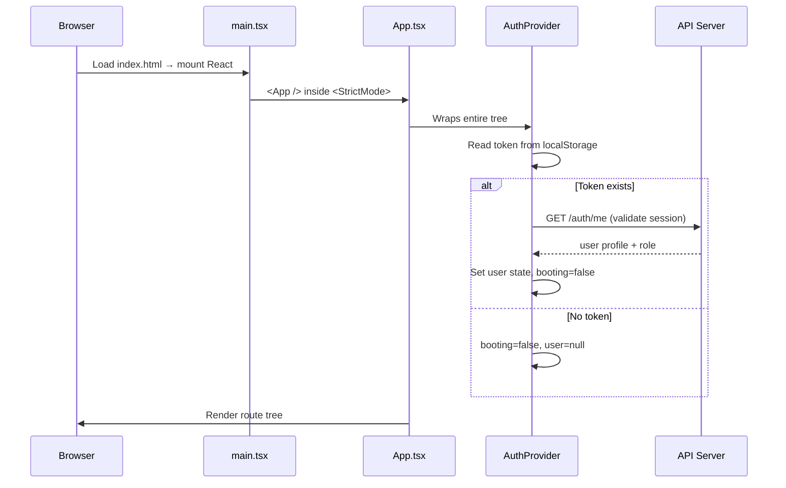
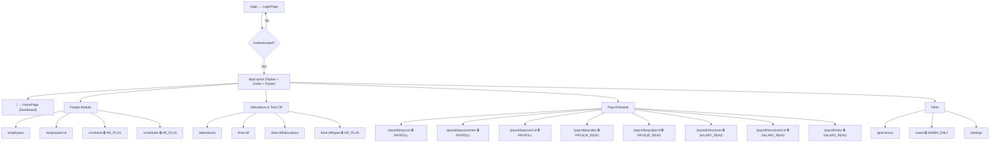
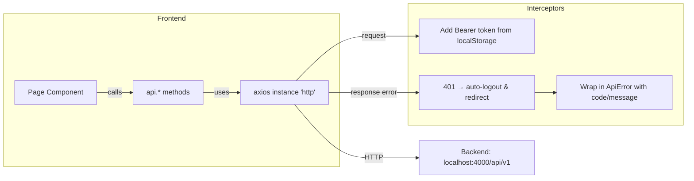
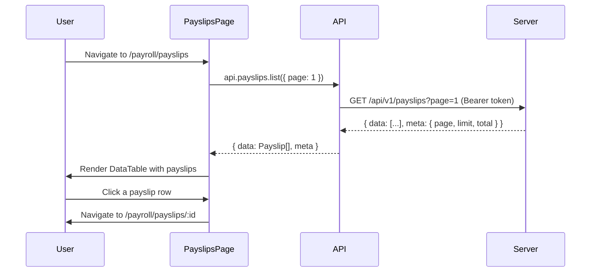
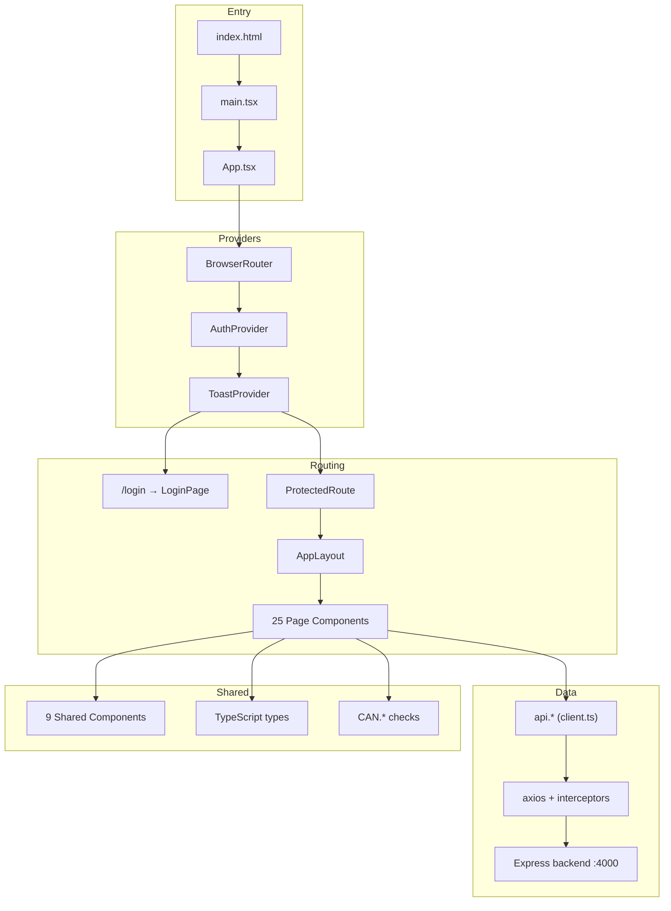

# PeoplePay360 — Frontend Architecture

## Tech Stack

| Layer | Technology | Version | Purpose |
|---|---|---|---|
| **Framework** | React | 19.2 | UI rendering with hooks-only functional components |
| **Language** | TypeScript | 6.0 | Static typing mirrored 1:1 from the server |
| **Bundler** | Vite | 8.2 | Dev server with HMR + production builds |
| **Styling** | Tailwind CSS | 4.3 (v4) | Utility-first CSS via `@tailwindcss/vite` plugin |
| **Routing** | React Router DOM | 7.18 | Client-side SPA routing with nested layouts |
| **HTTP** | Axios | 1.20 | API calls with interceptors for auth tokens |
| **Charts** | Recharts | 3.10 | Dashboard bar/line/pie charts |
| **Icons** | Lucide React | 1.41 | Consistent SVG icon set |
| **Linting** | OXLint | 1.79 | Fast Rust-based linter |

---

## Application Boot Flow



### Step-by-step:

1. **[main.tsx](file:///d:/Odoo-Hackathon-2026-Finalist/src/main.tsx)** — Entry point. Mounts `<App />` into `#root`.
2. **[App.tsx](file:///d:/Odoo-Hackathon-2026-Finalist/src/App.tsx)** — Sets up the provider hierarchy: `BrowserRouter` → `AuthProvider` → `ToastProvider` → `Routes`.
3. **[AuthContext.tsx](file:///d:/Odoo-Hackathon-2026-Finalist/src/auth/AuthContext.tsx)** — On mount, checks `localStorage` for a saved JWT. If found, calls `GET /auth/me` to validate. If the token is dead → auto-logout. If valid → populates user/role state. A `StorageEvent` listener syncs logout across browser tabs.
4. **[ProtectedRoute.tsx](file:///d:/Odoo-Hackathon-2026-Finalist/src/auth/ProtectedRoute.tsx)** — Shows a loading spinner while `booting=true`, redirects to `/login` if unauthenticated, or renders children if authenticated.

---

## Routing & Page Structure

The entire authenticated app lives inside a **nested route** wrapped by `<ProtectedRoute>` + `<AppLayout>`:



> 🔒 = Route is protected by `<RequireRole group="...">`. Unauthorized users see a friendly "not available for your role" card instead of being silently redirected.

### Legacy redirects:
- `/payroll` → `/payroll/payslips`
- `/leaves` → `/time-off`

---

## Role-Based Access Control (RBAC)

### 5 Roles (from least to most privilege):

| Role | Label | Scope |
|---|---|---|
| `EMPLOYEE` | Employee | Self-scoped — sees only own attendance, payslips, time-off |
| `HR_MANAGER` | HR Manager | People-ops (employees, contracts, schedules, time off) — **no payroll access** |
| `HR_PAYROLL_USER` | Payroll User | Everything HR_MANAGER can do **+** read payroll & salary config |
| `HR_PAYROLL_MANAGER` | Payroll Manager | Everything Payroll User can do **+** write salary rules, manage payruns |
| `ADMIN` | Administrator | Full access including user management |

### How it works:

- **[permissions.ts](file:///d:/Odoo-Hackathon-2026-Finalist/src/auth/permissions.ts)** defines `ROLE_GROUPS` (named sets of roles) and a `CAN` object with capability checks like `CAN.viewDashboard(role)`.
- **Route level**: `<RequireRole group="PAYROLL">` wraps restricted routes in [App.tsx](file:///d:/Odoo-Hackathon-2026-Finalist/src/App.tsx).
- **Component level**: Pages use `CAN.*` checks to conditionally show buttons (e.g., "Approve" on leave requests).
- **The Wall**: `HR_MANAGER` is deliberately excluded from all payroll groups — this is a design rule documented in code.

> [!IMPORTANT]
> The frontend RBAC is **UX only**. The backend enforces every permission independently. If the two ever disagree, the server wins and the user sees a 403 toast.

---

## Data Flow (API Layer)



### Key design decisions in [client.ts](file:///d:/Odoo-Hackathon-2026-Finalist/src/api/client.ts):

1. **Envelope unwrapping**: Every endpoint returns `{ success, data, meta? }`. The `get()`, `post()`, `patch()` helpers automatically extract `.data.data`.
2. **Pagination**: `getPaged<T>()` returns `{ data: T[], meta: { page, limit, total } }`.
3. **Error handling**: Server errors arrive as `{ error: { code, message } }` and get wrapped into a typed `ApiError` class.
4. **Auto-logout**: A 401 on any endpoint (except `/auth/me` during boot) clears the token and hard-redirects to `/login`.
5. **Parameter cleaning**: The `clean()` helper strips `undefined`/`null`/empty values so queries like `?status=` never reach the server.

---

## Layout & Navigation

### [AppLayout.tsx](file:///d:/Odoo-Hackathon-2026-Finalist/src/layouts/AppLayout.tsx)

```
┌──────────────────────────────────────────┐
│  Topbar (navigation + user menu)         │
├──────────────────────────────────────────┤
│                                          │
│  <Outlet />  ← current page renders here │
│  (max-width 1400px, centered, animated)  │
│                                          │
├──────────────────────────────────────────┤
│  Footer                                  │
└──────────────────────────────────────────┘
```

- Route changes scroll to top automatically.
- Each page fades in via `animate-rise` keyed on the pathname.

### [Topbar.tsx](file:///d:/Odoo-Hackathon-2026-Finalist/src/components/Topbar.tsx)

- Groups navigation into dropdown menus: **Dashboard**, **People**, **Attendance**, **Time Off**, **Payroll**, **Grievances**, **Users**, **Settings**.
- Menus are **role-aware** — items call `visible(role)` to show/hide based on the user's role.
- Includes a user avatar dropdown with profile info and logout.

---

## Shared Components

| Component | File | Purpose |
|---|---|---|
| **UI primitives** | [ui.tsx](file:///d:/Odoo-Hackathon-2026-Finalist/src/components/ui.tsx) | Reusable buttons, modals, avatars, inputs, cards, pager, filter bar, etc. |
| **DataTable** | [DataTable.tsx](file:///d:/Odoo-Hackathon-2026-Finalist/src/components/DataTable.tsx) | Generic sortable, paginated table used across all list pages |
| **StatusBadge** | [StatusBadge.tsx](file:///d:/Odoo-Hackathon-2026-Finalist/src/components/StatusBadge.tsx) | Colored pill badges for statuses (ACTIVE, PENDING, PAID, etc.) |
| **Toast** | [Toast.tsx](file:///d:/Odoo-Hackathon-2026-Finalist/src/components/Toast.tsx) | Toast notification system via `useToast()` context |
| **EmployeeForm** | [EmployeeForm.tsx](file:///d:/Odoo-Hackathon-2026-Finalist/src/components/EmployeeForm.tsx) | Shared form for creating/editing employees |
| **AttendanceWidget** | [AttendanceWidget.tsx](file:///d:/Odoo-Hackathon-2026-Finalist/src/components/AttendanceWidget.tsx) | Check-in/check-out widget with live timer |
| **PayrollCharts** | [PayrollCharts.tsx](file:///d:/Odoo-Hackathon-2026-Finalist/src/components/PayrollCharts.tsx) | Recharts wrappers for dashboard visualizations |
| **Charts** | [charts.tsx](file:///d:/Odoo-Hackathon-2026-Finalist/src/components/charts.tsx) | Common chart configuration helpers |
| **Topbar** | [Topbar.tsx](file:///d:/Odoo-Hackathon-2026-Finalist/src/components/Topbar.tsx) | Main navigation bar with role-aware dropdowns |

---

## Utility Libraries

| File | Purpose |
|---|---|
| [format.ts](file:///d:/Odoo-Hackathon-2026-Finalist/src/lib/format.ts) | Date/time formatting, currency (`money()`), humanisation, period helpers |
| [useApi.ts](file:///d:/Odoo-Hackathon-2026-Finalist/src/lib/useApi.ts) | `useAsync()` and `useAction()` hooks — data fetching with loading/error states |

---

## Typical Page Flow (Example: Payslips)



---

## Styling Architecture

- **Tailwind CSS v4** via `@tailwindcss/vite` plugin — no `tailwind.config.js` needed.
- **CSS custom properties** defined in [index.css](file:///d:/Odoo-Hackathon-2026-Finalist/src/index.css) for design tokens (`--canvas`, `--accent`, `--slate`, `--line`, `--muted`, etc.).
- Custom component classes (`.card`, `.display-sm`, `.icon-tile`, `.animate-rise`) built on top of Tailwind.
- Responsive breakpoints via Tailwind's `sm:`, `lg:` prefixes.

---

## Type System

All types live in [types/index.ts](file:///d:/Odoo-Hackathon-2026-Finalist/src/types/index.ts) and are **mirrored 1:1 from the server's serialization layer**:

- Enum values match exactly (`'FULL_TIME'`, not `'full_time'`)
- No client-side renaming or transformation
- **456 lines** covering: Auth, Employees, Contracts, Schedules, Attendance, Time Off, Salary Config, Payroll (Payruns + Payslips + Warnings), Grievances, Users, and Dashboard

---

## Complete File Tree

```
src/
├── main.tsx                  ← React entry point
├── App.tsx                   ← Provider stack + route definitions
├── index.css                 ← Design tokens + custom classes
│
├── api/
│   ├── index.ts              ← Re-exports from client
│   └── client.ts             ← Axios instance, interceptors, all API methods
│
├── auth/
│   ├── AuthContext.tsx        ← Session state, login/logout, /auth/me validation
│   ├── ProtectedRoute.tsx    ← Route guard + RequireRole gate
│   └── permissions.ts        ← Role groups, CAN.* capabilities
│
├── components/
│   ├── ui.tsx                ← Button, Modal, Avatar, Input, Select, Pager, etc.
│   ├── Topbar.tsx            ← Main navigation bar
│   ├── DataTable.tsx         ← Generic sortable/paginated table
│   ├── EmployeeForm.tsx      ← Create/edit employee form
│   ├── PayrollCharts.tsx     ← Dashboard chart components
│   ├── AttendanceWidget.tsx  ← Check-in/out with live timer
│   ├── StatusBadge.tsx       ← Colored status pills
│   ├── Toast.tsx             ← Notification system
│   └── charts.tsx            ← Recharts config helpers
│
├── layouts/
│   └── AppLayout.tsx         ← Topbar + Outlet + Footer wrapper
│
├── lib/
│   ├── format.ts             ← Date, currency, humanisation utilities
│   └── useApi.ts             ← useAsync / useAction hooks
│
├── pages/                    ← 25 page components
│   ├── Home.tsx, Dashboard.tsx, Login.tsx, NotFound.tsx
│   ├── Employees.tsx, EmployeeDetail.tsx, Contracts.tsx, Schedules.tsx
│   ├── Attendance.tsx, TimeOff.tsx, Allocations.tsx, TimeOffTypes.tsx
│   ├── Payruns.tsx, PayrunWizard.tsx, PayrunDetail.tsx
│   ├── Payslips.tsx, PayslipDetail.tsx
│   ├── Structures.tsx, StructureDetail.tsx, SalaryRules.tsx
│   ├── Grievances.tsx, Users.tsx, Settings.tsx
│   ├── MyWorkspace.tsx, PeopleOverview.tsx
│
└── types/
    └── index.ts              ← All TypeScript interfaces & enums
```

---

## Summary Flow


